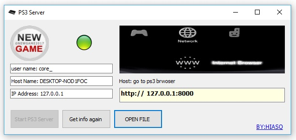

# PS3-SERVER (miniweb)

## PS3 SERVER (custom server) powered by miniweb

**POWERED BY miniweb**
##### easy to use setup and install 
* You can customize your web pages as much as you want. Change your page by page number within the program
* A small interface will show you the details and your IP address, as well as your HOST for  PS3 
details 
1. IP address 
2. host name
3. user name
4. host and port for ps3

https://github.com/HIASQ/PS3-SERVER/blob/master/1.jpg?raw=true

http://ne-game-w.blogspot.com/

